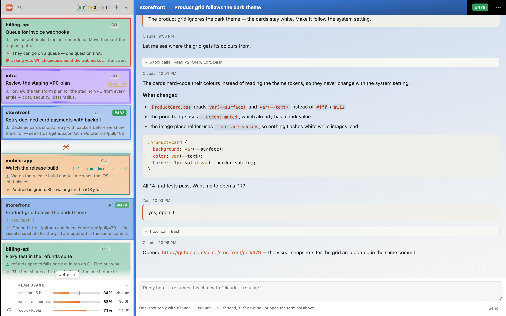
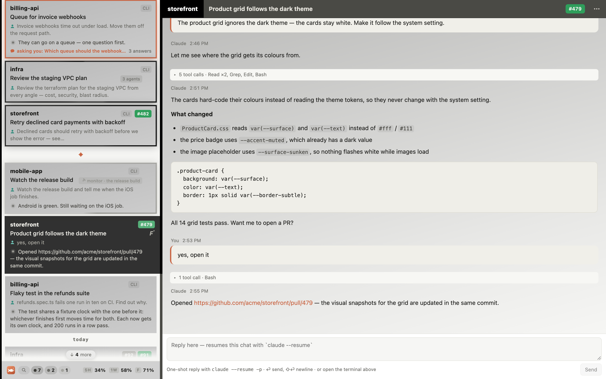
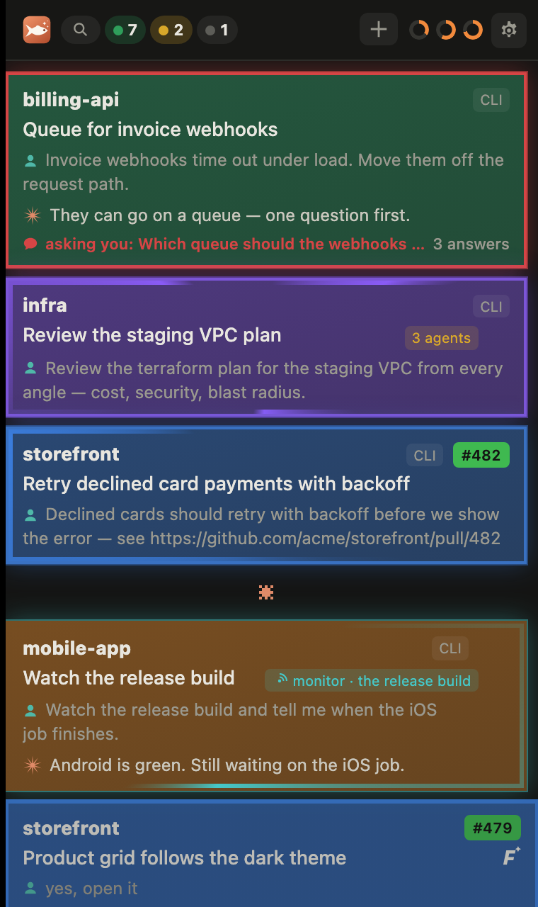
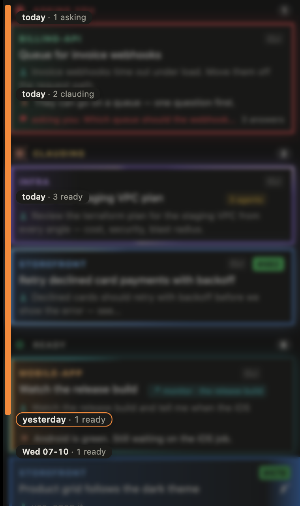
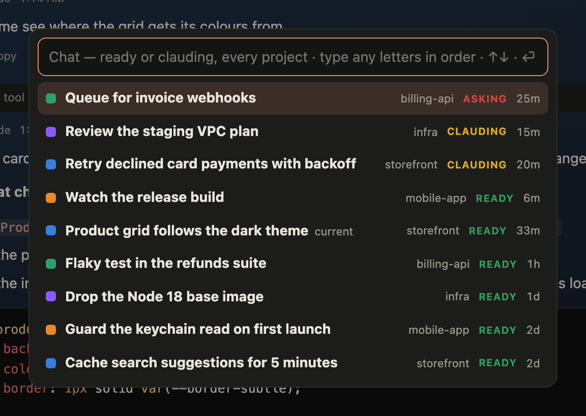

<div align="center">


# peixAIrada

**Every Claude Code chat on your Mac, on one board — the one waiting for you on top.**

[](https://nodejs.org)
[](mac/)
[](public/index.html)

</div>

<picture>
  <source media="(prefers-color-scheme: dark)" srcset="docs/shots/board-dark.png">
  
</picture>

<p align="center"><sub>Every project in its colour — or, with <b>simple colours</b> on (Settings › Board), every project in black and the states in grey:</sub></p>

<picture>
  <source media="(prefers-color-scheme: dark)" srcset="docs/shots/simple-dark.png">
  
</picture>

It reads what Claude Code already writes to `~/.claude` — no plugin, no private API, and it never writes there.

## ✨ Features

- 🚦 **Sorted by who owes whom** — in lanes: asking you first, then clauding, then ready. *Done* is a tick you give.
- 💡 **The card's edge tells you why it's busy** — each card a lit edge in its project's colour; a light runs round it
  (or down the edge, if you'd rather) while Claude works, one per sub-agent, slower for a monitor; a question pings out
  in red.
- 🖥️ **Claude in a drawer** — resume any chat in the real Claude Code terminal, inside the board: a chat whose Claude
  has ended says so, and resumes 5 s after you open it (or on a click, if you'd rather) — cloning its repo first, with
  the progress showing, when its folder isn't checked out. Drawers survive restarts; chats running in iTerm or VS Code
  can be taken over.
- 🔔 **Alerts** — a notification when a chat finishes or needs you; a Dock badge and menu-bar list in the app.
- 🐙 **PRs** — chips in GitHub's colours, stacked on a card and fanned out under the pointer (scroll them when they're
  more than fit); a chat with an open PR is named after it. A PR you reviewed or wrote fills in, notifies you and brings its ticked chat back when it's your
  move again — a push, a reply, a review.
- 🎫 **Jira tickets** — a ticket a chat names (`ACME-12`, a link, its branch) wears its status on the card and in the
  header, beside its PRs. Set your site, email and an API token in Setup.
- 🎨 **Projects** — folders in their [Peacock](https://marketplace.visualstudio.com/items?itemName=johnpapa.vscode-peacock)
  colour, or named sets of folders.
- 🌑 **Simple colours** — a quieter board: every project in black (or one colour you pick), the states in grey; PRs
  and faces keep their colours, and the accent is left for what needs you.
- 🪟 **Tabs and splits** — a shell, VS Code Web and GitHub pages beside the chat.
- 📊 **A status bar** — along the window's foot: the search and the state filters, connected and live chats, drawers,
  the faces on your PRs, your plan's limits (or its monthly spend cap), keeping the Mac awake (with the lid closed too,
  by Touch ID where sudo takes it; greyed out when the Mac wouldn't sleep anyway, as on a charger set never to), CPU and memory, and optionally what Claude's processes hold.

<table>
  <tr>
    <td></td>
    <td></td>
  </tr>
  <tr>
    <td align="center"><sub>asking · sub-agents · working · watching</sub></td>
    <td align="center"><sub>point at the scrollbar and the days come out</sub></td>
  </tr>
</table>

## 🚀 Install

**First, what it runs on** — the last three are optional: without one, only what it is for is missing.

| | For | Install |
|---|---|---|
| macOS 13 or later | the app, the login agent, the keychain | |
| Xcode Command Line Tools | `git`, and `swiftc` for the app | `xcode-select --install` |
| Node ≥ 22 | the server | `brew install node` — or mise, nvm, asdf |
| Claude Code, signed in | the chats themselves | `curl -fsSL https://claude.ai/install.sh \| bash`, then run `claude` once to sign in |
| [GitHub CLI](https://cli.github.com), signed in | PR states, faces and turns, cloning | `brew install gh && gh auth login` |
| VS Code | ⌥⌘E (VS Code Web); [Peacock](https://marketplace.visualstudio.com/items?itemName=johnpapa.vscode-peacock) for project colours | [code.visualstudio.com](https://code.visualstudio.com) |
| [Task](https://taskfile.dev) | folders whose Taskfile starts Claude | `brew install go-task` |

**Then**, from the shell you use every day — the login agent keeps its `PATH` and its `node`, which is how it finds
`claude`, `gh` and the rest:

```sh
git clone git@github.com:ricardobcl/peixairada.git && cd peixairada
npm install                    # node-pty comes prebuilt for macOS: no compiler needed
scripts/launchd.sh install     # the server, started at login → http://127.0.0.1:7331
mac/build.sh install           # the Mac app, in /Applications (optional — any browser works)
```

**On first open** the board asks where your repos live, its guess from your chats already filled in. macOS asks to let
`security` read the *Claude Code-credentials* keychain item (that's the plan usage — *Always Allow*), and the app to
show notifications.

**Updating**: `git pull && npm install`, then `scripts/launchd.sh restart` — your chats stay open — and
`mac/build.sh install` when `mac/` or the dependencies changed. After switching Node versions, or installing a CLI
somewhere new, run `scripts/launchd.sh install` and `mac/build.sh install` again.

**Removing**: `scripts/launchd.sh uninstall`, then delete `/Applications/peixAIrada.app` — and `~/.config/peixairada`
and `~/Library/Application Support/peixAIrada` to forget your setup and the board's state.

## ⚙️ Setup

**Settings** — ⌘, or ··· in the chat's header:

- **Board** — notifications, simple colours (every project in black, or one colour you pick, the states in grey, for a quieter board), the edge light, the status bar and what it shows, a floating header, card size, ⌥ as Meta.
- **Setup** — your repo folders and their GitHub org (⌥⌘N lists every repo and clones the ones you don't have), the
  project ⌥⌘O starts a chat in, a short name and a colour where Peacock has none, per project, and your Jira site,
  email and API token (the token goes to your keychain, never into the file).

The setup is a file of yours, `~/.config/peixairada/config.json` (`$XDG_CONFIG_HOME` moves it) — edit it by hand or
keep it with your dotfiles; the board picks up a change within seconds:

```json
{
  "roots": [{ "dir": "~/code", "org": "my-org" }],
  "quick": "my-service",
  "projects": { "my-service": { "abbr": "SVC", "color": "#2f7fd8" } },
  "jira": { "site": "https://my-org.atlassian.net", "email": "me@my-org.com" }
}
```

What the board records as you use it — done ticks, titles, pins — stays in `~/Library/Application Support/peixAIrada/`.

<details>
<summary>Environment variables</summary>

| Variable | Default | |
|---|---|---|
| `PORT` | `7331` | the board's port |
| `NOTIFY` | `native` (`off` with the app) | who posts notifications |
| `USAGE` | on | `off` hides the plan usage |
| `JIRA_API_TOKEN` | the keychain's | the Jira token, if you'd rather not keep it in the keychain |
| `DRAWER_IDLE_MS` | 24 h | an unwatched idle drawer ends itself; `0` never |
| `CLAUDE_BIN` `GH_BIN` `CODE_BIN` `TASK_BIN` | from `PATH` | where the CLIs are |
| `CLAUDE_DIR` · `STATE_FILE` | `~/.claude` · `~/Library/Application Support/peixAIrada/state.json` | what it reads · keeps |
| `CONFIG_FILE` | `~/.config/peixairada/config.json` (beside `STATE_FILE` when that is set) | the setup |

The login agent takes `PORT`, `NOTIFY` and your `PATH` at `scripts/launchd.sh install`.

</details>

## ⌨️ Keys

| Key | Does |
|---|---|
| ⌥⌘K | jump to any chat |
| ⌥⌘N · ⌥⌘O | new chat · new chat in your ⌥⌘O project |
| ⌥⌘P · ⌥⌘F | pick a project · filter the list |
| ⌥⌘↑ ⌥⌘↓ | previous · next chat |
| ⌥⌘C | this chat's Claude, in the drawer |
| ⌥⌘T · ⌥⌘E · ⌥⌘G | a shell · VS Code Web · the PR |
| ⌘2 · ⌘W | split · close a half |
| ⌥⌘B | fold the list |

Settings › Keys lists the rest.

<p align="center"></p>

## 🔒 Good to know

- Transcripts hold everything Claude read. The server listens on `127.0.0.1` only, with no login — keep it that way.
- Only `gh` (PR states, clones), the plan-usage call and Jira (once you set it up) leave your machine.
- A chat running elsewhere is never written to: take it over, or continue it where it is.

## 🛠 Hacking

`npm test` · `npm run check` · `npm run scenarios` — and `npm run scenario -- scripts/readme-shots.mjs` redraws these
screenshots from a made-up board. The browser checks drive Google Chrome (`CHROME` points at another).
[CLAUDE.md](CLAUDE.md) holds the working notes, [docs/DECISIONS.md](docs/DECISIONS.md) the why.

<div align="center"><br><sub>🐟 A <i>peixarada</i> is a Portuguese fish feast — more than anyone planned for.</sub></div>
