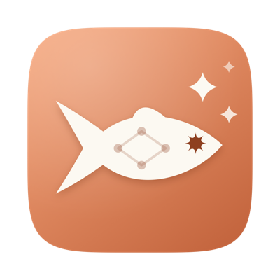
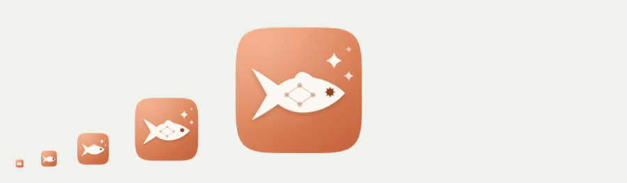

<div align="center">



# peixAIrada

### Every Claude Code chat on your Mac. One board.<br>**Zero guessing about which one is waiting for you.**

[](https://nodejs.org)
[](package.json)
[](public/index.html)
[](mac/)
[](mac/build.sh)
[](#-how-it-works-no-private-api-no-permission-needed)

</div>

---

## 🐟 The 4pm problem

Eight Claude Code sessions. Three VS Code windows, two terminals, and one you genuinely forgot about.

**Which one finished?** Which one is parked on a permission prompt for a `rm` you'd rather look at
first? Which one asked you a question forty minutes ago and has been sitting there, politely, ever
since — while you alt-tabbed straight past it?

peixAIrada puts every one of them on a single board, streams any transcript live, and **taps you on
the shoulder the moment one of them finishes or needs you**.

> *A **peixarada** is a Portuguese fish feast — a whole table of the stuff, more than anyone planned
> for. Drop an **AI** in the middle and you get this: your Mac, on a Tuesday afternoon.* 🐟

<div align="center">

</div>

---

## ⚡ Sixty seconds to a board

Node ≥ 20. macOS for native notifications; everything else is portable.

```sh
npm install                  # two runtime deps: node-pty (the terminal drawer) and ws
npm start                    # = node server.mjs  →  http://127.0.0.1:7331
open http://127.0.0.1:7331
```

That's it. That's the whole setup. Want it always there?

```sh
scripts/launchd.sh install   # starts at login, restarts if it dies; hands over from a running app
scripts/launchd.sh restart   # after a server.mjs change (the drawers survive; the app reattaches by itself)
scripts/launchd.sh status    # …also: logs · uninstall · print
                             # PORT=8000 scripts/launchd.sh install  to pick another port
```

The selected project, the state chips and column width are remembered **per browser**. **Done** ticks
and the **projects you name** live server-side in `~/Library/Application Support/peixAIrada/state.json`,
so they survive a restart and look the same in every browser *and* in the Mac app.

---

## 🍎 …or as a real Mac app

```sh
mac/build.sh install     # build → /Applications → launch   (mac/build.sh alone just builds)
```

A 180 KB binary plus the icon, the server, its two dependencies and **the node that runs it** (the
one on your PATH at build time, so about 180 MB all in — most of it node). It all lives in
[`mac/`](mac/). It wraps the same board in a `WKWebView` — no Electron — and adds the things a web
page simply cannot do for itself:

|  | What the app adds |
|---|---|
| 🚀 | **Owns the server.** Starts `server.mjs` on launch with the node inside the bundle (no PATH games, no version-manager guessing), stops it on quit. If a server is *already* running on the port — from `npm start` or the launchd agent — it attaches to that one instead and defers to it for notifications, so you never get two of everything. |
| 🔔 | **Native notifications** from *peixAIrada*, not from "Script Editor" — and clicking one opens that session in the board. Only fires while the window isn't in front. Falls back to the old `osascript` banner if notification permission is refused. |
| 🎯 | **Dock badge** with the alerts you haven't seen, and a **menu-bar fish** whose menu lists every session waiting on you. Click one to jump straight to it. |
| 🐙 | **Pages as tabs.** Click a PR row under the chat header (or a card's chip) and the pull request opens on a tab of the chat — beside *chat*, *zsh* and *VS Code* — in a web view of the app's (GitHub refuses to be framed), with ‹ › ↻ ↗ in the strip and your GitHub login kept between launches. **Esc** or the *chat* tab brings the chat back; **×** on a tab forgets its page. |
| ⌨️ | ⌘R reloads what is in front of you — the page on the pane while one is up, the board otherwise; ⌘⇧R restarts the server. **⌘F finds on the page in the pane**, as a browser does: a bar over its top right, ⏎ / ⇧⏎ or ⌘G / ⇧⌘G for the next match and the one before, esc to close it (no *1 of 12* — WebKit only says whether it found one, and a miss turns the text red). Close the window and it keeps running in the menu bar. |
| 🎨 | **An icon drawn in code** ([`mac/icon/MakeIcon.swift`](mac/icon/MakeIcon.swift)) — a fish in Claude terracotta with a starburst eye, no image assets anywhere — that simplifies itself at 16/32 px so it stays legible in the menu bar. |

Logs live in `~/Library/Logs/peixairada.log` (server) and `peixairada-app.log` (the shell:
notification permission, every alert, badge counts, the PR pane). Ad-hoc signed — this machine,
not distribution.

<details>
<summary><b>😤 "It says the bundle has no node"</b></summary>

<br>

The app runs the node that `mac/build.sh` copied into it at build time — the one on your PATH in
that shell, which is also the one that ran `npm install`, so the native `node-pty` addon matches
it. Rebuild after switching node versions. To run the app against a different node without
rebuilding, launch it with `PEIXAIRADA_NODE=/path/to/node`, or just `npm start` in the repo and
reopen the app — it attaches to any server already on the port.

</details>

**Prefer no app at all?** Chrome → ⋮ → *Cast, save and share* → *Install page as app…*, or Safari →
*File → Add to Dock*. A window and a Dock icon, zero build.

---

## 🎛 Projects → chats → chat

Three columns, left to right. Pick a project, pick a chat, read it — and talk to it.

**Projects.** One entry per folder a chat has run in — the repo path Claude Code registered for
the session, so `cd`-ing around inside a chat never splits it — ordered by the newest thing
*you* did in any of its chats. **ALL** sits on top as the flat list. Under it come the
projects **you name yourself**: a name over one or more folders, for multi-repo work or an
investigation — **+** in the column header, ✎ on hover to edit or delete. A chat belongs to its
folder *and* to every named project that claims that folder (worktrees under a repo count as the
repo). Each entry carries counts you can read from across the room — 🔴 waiting on you, 🟡 Claude
working, 🟢 replied — plus an unread badge.

The projects column is a **strip** by default — each project a solid tab in its colour, the name
running vertically, the selected one running straight into the chat list, whose edge and header
carry the same colour — and **»** opens it into the full column, **«** folds it back; nothing happens on hover. The fish at the strip's top is the
app — it greys out when the board loses the server, and **hovering it opens the usage card** (below). The
magnifier under it filters projects (the strip opens to let you type and folds back when you are done);
**⌥⌘P** from anywhere opens a project picker the VS Code way — type to filter, ↑↓, ⏎ opens it, esc closes;
**⌥⌘K** the same box filled with **every chat that is ready or clauding**, across the projects, in the list's order
(colour · title · project · state · age), searched by title, project, prompt or branch — ⏎ opens it, switching project
when it lives elsewhere; **⌥⌘N** a **new chat**: pick the project — or one of the folders in `~/acme` that has no chat yet, they come
after the board's own, or type a name none of them has and **＋ clone `acme/<name>`** into `~/acme` (`gh repo
clone`, then straight on into the chat) — then one of its open chats or ＋ a new one, the folder when the project
spans several, and — in a folder whose Taskfile launches claude (see *+ new chat* below) — the environment; **⌥⌘O** is that
flow with the first answers in — a new chat in **oracle**, opening straight on its environments (the
same ⌥⌘ family drives the open chat: **⌥⌘C** its claude session, **⌥⌘T** a zsh in its folder, **⌥⌘E** VS Code Web,
**⌥⌘G** its PR, **⌥⌘↑ / ⌥⌘↓** the chat above or below in the list, **⌥⌘← / ⌥⌘→** the tab beside — chat, zsh, GitHub
pages, VS Code — see *The chat*) —
and the **cog** at its bottom opens the settings (show empty & >30d, tool calls, fold code, sound,
browser alerts, test alert) and, under them, **the list of keys**, for when one slips the mind. The usage card on the fish (a click pins it) is your **Claude plan usage**: the session and weekly windows `/usage` shows,
plus a weekly row per model the account meters apart (Fable, Sonnet…), read with Claude Code's own login.
Buckets the API reports under a codename at 0 % stay out of the list. The first time, macOS asks whether `security` may read the
*Claude Code-credentials* keychain item; *Always Allow* ends that, and `USAGE=off` on the server turns the
lookup off. Esc or a click elsewhere closes either popover. There is no page header.

**A project's colour is its Peacock colour**, and it is the same everywhere — the strip tab, the card's
edge, the chat list's edge, the chat header. The board reads `peacock.color` from the nearest
`.vscode/settings.json` at or above the folder (a chat in a subfolder or a worktree wears the repo's colour)
and follows it live: change the colour in VS Code and the board has it within seconds. A folder without one is
light gray, with one exception the board paints itself: **`acme`**, the root the repos sit under, where the odd
chat that belongs to no repo runs, is **black** in both themes — like ALL — so it reads as the plain one among the
coloured ones. Give it a Peacock colour and that wins, as everywhere else.
**And it works the other way**: the **colour square** on a folder's row in the open column — and the one in
the chat list's header — is a picker. Click it, pick a colour, and the board writes it as `peacock.color` into
that folder's `.vscode/settings.json` (creating the file if there is none, touching nothing else in it), so
Peacock repaints the VS Code window and both agree; the board follows while you drag through the panel and
writes once it rests. ⌥-click the square to take the setting out again. A note by the square says which file
was written and, if git tracks it in the repo, that the change will show in `git status`.
**Pin** a project (the pin on its row in the open column) and it heads the column, above a line; **drag**
rows — in the strip too — to arrange the pinned ones, or drag one below the line to let it go. Pins are saved
on the server, so every browser and the app agree. Each of
the first two columns has its own filter behind a magnifier — in the projects header, and at the
start of the chat filter chips — projects by name, chats by title, branch or prompt; Esc or an
emptied box closes it, and the magnifier stays lit while a filter is on.

**Chats** of the selected project, newest first by your own last touch, with a chip per state —
*ready · clauding · done* — each a toggle, and the set you leave on is remembered. A card is washed in its project's
colour; only a clauding card (the running light), a hovered one and the open one wear the colour on their edge too. **«** in its header folds the list to a rail and **»** brings
it back, width and all. **+ new chat** starts one right there: a terminal
running `claude` in that folder (a pick-list when the project spans several), and the chat pane
switches to it the moment Claude registers the session. **A folder that launches claude its own way** — a
Taskfile whose tasks say *Launch Claude Code…*, the way oracle's `task production-workload`, `task sandbox-workload`
and `task development-<cluster>` set a cluster's environment before running claude — asks **which environment** first
(the picker, every time: the task's name and what the Taskfile says it does — **⌥⌘O** opens it on oracle from
anywhere) and runs `task <name>` in the terminal instead; the board finds the chat under it all the same. Nothing is configured: any folder whose `task --list`
mentions Claude in a description gets the question.

**Chat**: the PRs the chat mentions, the transcript, the terminal drawer, the reply box. Described below.

A chat is always in exactly one state, and the dot says which:

| | State | What it means |
|---|---|---|
| 🟢 | **ready** | The ball is with **you**: Claude replied — or asked a question, wants plan approval, or waits on a permission, and then the card says *asking you*. A chat whose Claude process is gone (panel or terminal closed) is ready too — grey dot, card dimmed a touch: open a terminal on it here, continue it in VS Code, or `claude --resume <id>`, and it walks back on its own. Such chats idle >30 days hide behind *show empty & >30d*; Claude Code deletes their transcripts after 30 days anyway. |
| 🟡 | **clauding** | Claude is working — a prompt is in flight or tools are running. The card's edge carries a running light in the project's colour. |
| ✓ | **done** | Only what **you tick ✓** — nothing is done by itself. Persisted server-side. The mark **expires the instant the chat has new activity**, so a chat you re-prompt comes straight back. Done chats sink to the bottom of the list, dimmed. |

### Sorting

The chat **you** wrote to most recently comes first — the one rule, in every list. Claude finishing
a long job does not move its card up; answering its question or interrupting it does. So the chats
you are actively driving stay at the top and the ones you have parked sink by themselves. The time on
a card is still when *anything* last happened to it; hover it for when you last wrote. Projects
follow the same rule through their newest chat.

The filter box in the header narrows the chat list by repo, title, session name or branch. The
divider between the chat list and the chat drags; the width, the selected project and the state
chips are remembered per browser.

### Anatomy of a card

Every card leads with its **state dot**, the **repo name** when the list spans several folders
(*ALL*, a named project) and where it is live (VS Code, CLI, or a terminal here), then the
session title with its age and the ✓ on the same line, the PRs it mentions as `#32`-style chips in
GitHub's state colours (click one and that chat opens with that PR), the last thing you asked and the
start of Claude's reply — each marked by a glyph
rather than a word — a teal figure for you, Claude's sunburst in clay for Claude, with Claude's line
set brighter because that is the one you scan a list for. The card answers *what changed*; the dot
answers *what state it is in*.

What a chat *is* rather than what just happened — VS Code or CLI, the session name
(`peixairada-f1`), the path and branch, the model, the pid — lives in the **chat header** on the
right, folded behind the **status dot** so the header fits on **one line**: repo / title, the dot with how
long it has been that way (click it for the fold), the `{ }` code-fold toggle, the ◎ **focus-view** toggle while a
claude runs in the drawer — it types Claude Code's own `/focus` into that session (your prompt, the summary and the
reply only, every step in between hidden) and lights up from the line the session answers with, so what it shows is
the session's state and not a wish; it reads that line again whenever the drawer attaches, so a `/focus` you type
yourself is picked up as well —, the VS Code and terminal buttons. No status
word — the dot's colour says it and hovering spells it out. Click the repo name in the header to
jump to that folder's chats.

**The PRs a chat mentions sit under the header, one per row**: the state in GitHub's colours, `repo#n`,
the whole title once `gh` has answered, and when it was last mentioned. Six rows, then **… n more**.
Click one and the PR pane opens on it.

### 💬 The chat pane

Click any card to open its transcript, live.

Consecutive tool calls (Bash, Read, Edit…) fold into a single line — *"12 tool calls · Bash ×9,
Read ×3"* — so the conversation actually **reads as prose** instead of a wall of JSON. The header's
**tools:** selector switches between collapsed / expanded / hidden, and **fold code** tucks fenced
blocks longer than 6 lines behind a *"bash · 23 lines"* summary.

**The header lists every PR the chat mentioned** — one chip per pull request, most recently
mentioned first, so the one you are on now leads. It picks them up from the URLs you or Claude wrote
in the conversation as well as from Claude Code's own `pr-link` lines.

**A chat with a PR is named by it.** The card and the header lead with the pull request's own title
instead of the one Claude wrote for the chat — the name the work already has on GitHub, on the
branch and at standup. Where a chat mentions several, the title comes from the *oldest one still
open*: the later ones tend to be references, and a merged PR is finished business. A title you set
yourself still wins over both, and hovering the title says which PR it came from and what Claude had
called the chat.

Each chip is **coloured by what GitHub says about it** — green open, violet merged, red closed, grey
draft — looked up through your own `gh` CLI, so a chat you have not touched in a week tells you at a
glance which of its PRs actually landed. A neutral chip means the lookup has
not come back (or `gh` is not installed — then the colours simply never appear). Hover for the full
title and URL, the state, when it last came up and how many times it was mentioned.

**⌨ Chat from the board — in a real terminal.** The `>_` button in the chat header opens a drawer
under the transcript running *Claude Code itself*: `claude --resume <id>` for that chat, in its
folder, in a pseudo-terminal on the server, shown through xterm.js. It is the actual TUI, so
everything it can do you can do here — permission prompts, questions, plan mode, slash commands,
pasting — and it registers and writes its transcript exactly like a Terminal.app run, so the card
above walks Stale → Clauding → Ready and the rendered chat keeps up. Read above, type below. **+**
starts a *new* chat in the same repo the same way; the pane switches to it as soon as Claude
registers the session. The process lives on the server: switching chats keeps it running, and since
2026-09-20 it survives a server restart: each drawer is a small holder process of its own that the server
connects to, so `scripts/launchd.sh restart` leaves every chat running. While the chat runs here, the drawer
*is* the pane — the rendered transcript would be the same conversation twice — and the transcript comes back on
its own when the process ends; nothing is hidden or shown by hand. **Ticking a card done ends its claude** (the
drawer's, or one live elsewhere), so a finished chat costs nothing. **`/clear` in the drawer** starts a new chat in the
same process, as it does anywhere: the board follows it — the drawer stays, the pane switches to the new chat, and
the old one is a card without a process (resume it and its old context comes back, in a second process). **⇧⏎**
is a newline in Claude's prompt, as in iTerm2 or VS Code; ⏎ sends. Chats
the board does not drive — VS Code, another terminal, stale — always render. **⌘+ / ⌘− / ⌘0** resize
the chat pane, transcript and terminal together, and the size is remembered. **⌥⌘C** is the `>_` button:
the chat's claude session in the terminal, opened or started, and the keyboard lands in it (on a chat live
elsewhere the first press arms the take-over and the second ends that claude, as two clicks would). **⌥⌘T** is a
fresh zsh in the chat's folder, inline: a *zsh* tab appears beside the chat (*claude* while it runs here, *chat*
otherwise), one per chat, `exit` or its × ends it, and ⌥⌘C brings the claude session back. **⌥⌘E**
opens the folder in VS Code Web, on a *VS Code* tab of the same strip — the *web* button's route (the real VS Code
is the focus button in the header, no key). **⌥⌘G** opens the chat's PR on GitHub — straight away with
one; with several, the same picker filled with the PR rows under the header (state · `repo#n` · title · age,
filtered by number or title, ⏎ opens the selected one, the one showing marked *current*) — **every time**, a tab
already open or not; each PR is a tab of its own (`repo#n`) so nothing reloads. The
keys work from inside a page's tab too, **⌥⌘← / ⌥⌘→** walk the strip's tabs (wrapping round), and **Esc** there brings the chat back. **Esc with a picker or popover up closes
it and nothing else** — in the app it used to leave full screen as well. With no chat open, or no PR in it, a note under the header says so; while
a dialog is up the keys do nothing. **Double-click the
title** in the chat header to rename a chat; the name is kept by the board (never written into the
transcript) and beats the PR title and Claude's own; an empty name gives the chat's own back. A chat that is live
somewhere else — **another terminal** (iTerm, say) or **VS Code** — can be **taken over**: the `>_`
button says so, a first click arms it, a second ends that claude and resumes the chat here. Nothing
respawns a CLI claude, and VS Code's extension does not respawn its own either, so the transcript keeps
one writer; anything Claude was mid-way through is lost, and the button says *mid-reply* when that is the
case. The first time in a folder Claude asks its usual *trust this folder?* question.

**VS Code chats carry a VS Code mark, and can be taken over.** A chat whose last turn came from the VS Code
extension shows a small **VS Code mark at the top right of its card and at the end of the chat header**;
cards and the chat pane are washed in the *project's* colour, VS Code or not, and in a light gray without one. The VS Code
button opens it there. Taking it over (`>_`, armed as *sure? ends VS Code's*) ends the claude VS Code
runs on it and resumes the chat in the drawer, from which point it is a CLI chat. What that costs, and
the tooltip says so: **the tab in VS Code goes dead and does not follow the chat** — close it there.
VS Code starts a claude whenever a chat is *opened* in it (it never restarts one that died — measured on
2.1.278, which is what made this possible; until 2026-09-20 the board believed the opposite), so if you
open the chat there again, a second claude appears on it: a **red bar under the header** says so, warns
that anything typed there forks the transcript, and its **end it** button ends that one too (the card
gets a *VS Code too* chip meanwhile). A stale chat last continued in VS Code can be written to from
here as well, terminal or reply box — the box notes that the tab there will not follow. A chat started
here becomes a VS Code chat the moment you continue it in VS Code, and the other way round.

**VS Code, inline — experimental.** The **web** button next to the VS Code one opens the chat's
folder in *VS Code Web* in the same pane the PRs use: the editor served on this Mac by `code
serve-web`, with a server-side extension host, so it is your real files, a real terminal, real git —
and the Claude Code extension, which reads the same `~/.claude`, so its sidebar lists the same
chats. The board starts the server on first use (loopback only, port 7332, `VSWEB_PORT` to change)
and adopts one that is already running. Two things to know: it is a **separate VS Code** — its own
settings, its own extensions, installed once into `~/.vscode-server/extensions` with the server's
own CLI:

```sh
~/.vscode/cli/serve-web/*/bin/code-server --install-extension anthropic.claude-code
```

and the folder has to be **trusted once** (the *Restricted Mode* item in its status bar → *Trust*;
the decision lives in the pane's browser profile, so it sticks). The desktop extension's deep link
does not reach this instance; open a chat from its own sidebar.

**Click a PR chip and two things happen.** A strip under the header says what `gh` knows about it —
open / merged / closed / draft, the review decision, checks passed or failing or still running,
+added −deleted over how many files, head → base, the author — and the PR itself opens: in the Mac
app on a **tab of the chat** — the strip under the header lists *chat* (or *claude* while its session runs here),
*zsh* while one lives, a `repo#n` tab per PR the chat opened and *VS Code* for its folder's editor — shown in a
web view of the app's over the chat column below the strip (GitHub refuses to be framed; your GitHub login
sticks between launches), with ‹ › ↻ ↗ at the strip's right for that page. Nothing reloads when you switch tabs
or chats: each chat comes back on the tab it was on, its pages kept, and the eight most recently shown pages
stay loaded. **Esc** brings the chat tab back, from the board or from the page (the editor gives up its own Esc
for that); **×** on a tab forgets its page; a chip, a PR link or the web button opens one again. In a plain
browser, a new tab. PR links in Claude's replies and in the terminal do the same.

**📎 Attach a file: drop it on the chat.** Drag a file from the Finder onto the chat and it lands in the
terminal's prompt as an `@` mention (`@path/to/file`, a space escaped as `\ ` — what Claude Code itself
writes when you pick a file with `@`), or in the reply box on a stale chat; a dashed outline shows where it
is going, and if there is nowhere for it yet (a live chat with no terminal open here) a note says so.
Screenshots and other clipboard images paste with **⌃V** in the terminal, as in any terminal running Claude
Code — ⌘V works too, the drawer hands the same key on — and with ⌘V into the reply box. In a plain browser
the file's bytes are uploaded and saved beside the board's state
(`~/Library/Application Support/peixAIrada/attachments/<chat>/`, never cleaned up), because a web page
never learns a dropped file's path; in the app the path is used as is, nothing is copied.

**On a stale CLI chat there is also a one-line reply box** — type, ⏎, and the board resumes the chat
with `claude --resume <id> -p`; ⇧⏎ for a newline. It hides while a terminal is open on that chat.

`hide chat` / `show chat` toggles it, `◨ chat right` / `◧ chat left` flips which side it sits on, and
the divider drags to resize — all remembered per browser. Messages render as GitHub-flavoured
markdown through **vendored** copies of `marked`, `DOMPurify` and `highlight.js` in
[`public/vendor/`](public/vendor/) (no CDN at runtime, ever) — so code blocks come out **syntax
highlighted**, in a palette that follows the light/dark theme. Relative file links Claude writes —
`[server.mjs:42](server.mjs#L42)` — resolve against the session cwd and **open in VS Code**.

---

## 🔬 How it works (no private API, no permission needed)

Here's the trick: **Claude Code already writes everything to disk.** The CLI and the VS Code
extension run the same binary and share the same files. peixAIrada just reads them.

> **It never writes a single byte back into `~/.claude`.** No plugin, no patch, no private API, no
> cooperation from Claude Code required. If peixAIrada vanished tomorrow, Claude Code wouldn't notice.

| What | Where | Used for |
|---|---|---|
| Full transcript, appended line-by-line as JSONL | `~/.claude/projects/<cwd-slug>/<session-id>.jsonl` | Messages, tool calls, status, titles, PR links |
| Live-session registry, one file per running process | `~/.claude/sessions/<pid>.json` (`sessionId`, `cwd`, `name`, `entrypoint: "claude-vscode" \| "cli"`) | Which sessions are alive, which come from VS Code, names, the stable repo path |
| Where a chat lives | `entrypoint` on every transcript line — `"claude-vscode"` or `"cli"` — and the registry's while it runs | VS Code chats: a VS Code mark on the card and in the header; a chat live elsewhere: take over |
| Session titles | `ai-title` / `custom-title` lines inside the transcript | Card titles |
| End of a reply | assistant line with `stop_reason: "end_turn"` (tool calls are `"tool_use"`) | The "replied" alert → Waiting feedback |
| Waiting for the user | `AskUserQuestion` / `ExitPlanMode` tool call with no result yet | The "needs input" alert |
| Hooks *(optional)* | `~/.claude/settings.json` → `Stop`, `Notification(permission_prompt…)`, `UserPromptSubmit`, `SessionEnd` | Exact signals, including **permission prompts**, which never reach the transcript |

`fs.watch(…, { recursive: true })` fires on every append (verified on macOS / Node 24), so the board
updates within **~100 ms** of Claude writing a line. Native notifications work from plain Node via
`osascript` — which is exactly why **Electron is not required**.

```
  ~/.claude/projects/**/*.jsonl  ──fs.watch────▶┐
  ~/.claude/sessions/*.json      ──poll+watch──▶│                                   ┌──▶  the board
  Claude Code hooks (optional)   ──POST /hook──▶├──▶  server.mjs  ──SSE /events──▶──┤     projects · chats · live transcript
  …/peixAIrada/state.json        ◀─done ticks──▶┘     tail from byte offset         └──▶  unread badges · alerts
                                                      fold lines → session state
                                                              │
                                                              └──▶ osascript ──▶ 🔔 native macOS alert
```

* **Startup:** reads the last 512 KB of every transcript — ≈200 files / 0.5 GB indexed in **~0.4 s** —
  then tails from the byte offset. A full file is parsed only when you open its chat.
* **Alerts:** debounced 400 ms (a reply's thinking block and text block arrive as separate lines) and
  suppressed entirely during the initial scan, so starting up doesn't fire twenty banners. They land
  as a *system* notification plus the unread badge on the card — there is no in-page toast, on
  purpose: in the Mac app it duplicated the banner the app had just posted.
* Subagent transcripts, sidechain lines, injected skill/meta lines and `<system-reminder>` blocks are
  filtered out. `[Request interrupted by user]` flips a session back to idle.

<details>
<summary><b>🔌 HTTP surface</b> — every route, all bound to 127.0.0.1</summary>

<br>

| Route | Purpose |
|---|---|
| `GET /` | the UI (`/vendor/*.{js,css}` serves the vendored libraries) |
| `GET /events` | SSE: `snapshot`, `session`, `entries`, `alert`, `terminal`, `projects` |
| `GET /api/sessions` | summaries of every known session (incl. `done`), plus the named projects |
| `GET /api/pr?url=` | what `gh pr view` says about one PR: state, review decision, checks, size, branches (cached 60 s) |
| `GET/POST /api/projects` · `PUT/DELETE /api/projects/:id` | the projects you name: `{name, cwds}` — a name over absolute folder paths (persisted in the state file) |
| `GET /api/sessions/:id/messages` | full (capped) entry list, parsed on demand |
| `PUT /api/sessions/:id/title` `{title}` | rename on the board (state file, not the transcript); empty clears |
| `POST /api/sessions/:id/done` `{done: true\|false}` | tick / untick a card (persisted in the state file) |
| `POST /api/sessions/:id/reply` `{text}` | **stale CLI chats only** — resumes the chat with `claude --resume <id> -p <text>`; 202 and the answer arrives through the transcript; 409 on a live chat or a VS Code chat |
| `POST /api/sessions/:id/takeover` `{cols, rows}` | end the claude this chat is live in (SIGTERM, SIGKILL after 5 s), then the same as `terminal`; 409 for a VS Code chat or one not live |
| `POST /api/sessions/:id/terminal` `{cols, rows}` | attach to this chat's terminal, or start one with `claude --resume <id>` in its cwd; 409 if the chat is live elsewhere or lives in VS Code |
| `POST /api/terminals` `{cwd, cols, rows}` | start a **new** chat: `claude` in a PTY in that folder; the `terminal` SSE event carries its session id once Claude registers |
| `GET /api/terminals` · `DELETE /api/terminals/:id` | list terminals · end one (SIGHUP) |
| `PUT /api/peacock` · `DELETE /api/peacock` `{cwd, color}` | write (or remove) `peacock.color` in the folder's `.vscode/settings.json`; the folder must be one the board knows; answers `{file, changed, tracked}` |
| `PUT /api/attach?session=<id>&name=<file>` (raw body) | save a dropped file for a browser page that has no path to give claude; answers `{path}`; 50 MB cap |
| `WS /api/terminals/:id/ws` | the terminal: binary frames are output (the screen as it stands first — serialized from the headless xterm the server keeps per drawer — then the PTY's bytes), text frames are JSON — `{t:'in', d}` / `{t:'resize', cols, rows}` up, `{t:'exit', code}` down |
| `POST /api/sessions/:id/focus` | runs `code <cwd>` to bring that window to the front, then opens `vscode://anthropic.claude-code/open?session=<id>` so the chat itself comes up in the Claude panel |
| `POST /hook` | receives Claude Code hook payloads (`hooks/hook.sh`) |
| `POST /api/vscode-web` | start `code serve-web` if nothing answers on its port, and say where it is: `{url, started}` |
| `POST /api/test-notify` | fire a test alert |

**Environment:** `PORT` (7331) · `HOST` (127.0.0.1) · `NOTIFY=native|off` · `CLAUDE_DIR` (`~/.claude`) ·
`STATE_FILE` (defaults to `~/Library/Application Support/peixAIrada/state.json`;
`$XDG_STATE_HOME/peixairada/` off macOS) · `TAIL_BYTES` · `MAX_ENTRIES` · `CLAUDE_BIN` (path to the
`claude` binary, if PATH can't find it) · `REPLY_TIMEOUT_MS` (10 min) · `TERM_SCROLLBACK_LINES` (5000 lines of
screen kept per drawer for a page that attaches; `TERM_SCROLLBACK`, 256 KB of raw output, is the fallback without
`@xterm/headless`).

</details>

---

## 🧪 Hacking on it

Everything an agent — or you — needs to change this without guessing, in `package.json`:

| Command | What |
|---|---|
| `npm test` | `node:test` over `test/`: the transcript folder, PR titles, the Peacock edit, and the drawers end to end (a throwaway server, the fake claude, a holder, a server restart under it) |
| `npm run check` | Ten seconds of static checks: every script parses, the page's inline script compiles, the shell parses, the Swift type-checks |
| `npm run verify -- "<js>"` | One expression evaluated on the live board in headless Chrome (`--hash <id>`, `--shot file.png`, `DARK=1`, `URL=`) |
| `npm run scenario -- scripts/scenarios/<name>.mjs` | A multi-step browser check: the scenario declares its needs (a server, the fake claude, a fixture) and the runner starts and cleans up all of it; screenshots per step under `$TMPDIR/peixairada-shots` |
| `npm run map` | Rewrite the section maps at the top of `server.mjs` and `public/index.html` from their banners |

`scripts/fakeclaude.mjs` stands in for the CLI in tests — registers, writes transcript lines, draws a prompt box and a
status bar that ticks the way Claude Code's does, repaints on resize — and refuses to touch the real `~/.claude`.
`scripts/fixture.mjs` makes a small `~/.claude` look-alike; `lib/testserver.mjs` runs `server.mjs` on a free port
with its own state and ends what it started. The working notes for a session are `CLAUDE.md`; the reasoning and
history are `docs/DECISIONS.md`.

## 🪝 Optional: hooks, for signals instead of guesses

Watching the transcript already gets you "replied" and "asked a question". What it **cannot** see is
a pending **permission prompt** — Claude waiting on you to approve a tool call. That never reaches
the transcript at all.

Hooks close that gap and make "replied" *exact* rather than inferred. They fire for VS Code sessions
too, since the extension and the CLI share settings.

Merge [`hooks/settings-snippet.json`](hooks/settings-snippet.json) into `~/.claude/settings.json`.
[`hooks/hook.sh`](hooks/hook.sh) POSTs the payload with a 1 s timeout, in the background, and always
exits 0 — so Claude is **never** slowed down or blocked, even with the server stopped. Restart or
`/hooks`-reload your sessions to pick it up.

---

## 🤔 Why not Electron?

| | Web page + local server *(this)* | Electron |
|---|---|---|
| Access to all chats | ✅ same — both just read `~/.claude` | ✅ same |
| Native macOS notifications | ✅ via `osascript` (shows as "Script Editor"; `terminal-notifier` fixes the icon) | ✅ first-class, own icon, click → focus |
| Menu-bar / dock badge with unread count | ❌ tab-title badge only | ✅ |
| Always-on-top mini window | ❌ | ✅ |
| Install / update cost | **two deps (a PTY, a WebSocket server), one file** | ~250 MB app, signing, notarising |
| Reuse | UI is already HTML — Electron could load the same page | — |

**The verdict:** keep the web page + server (plus a `launchd` agent so it's always up, and
"Add to Dock" for its own window). The **native Mac app above already buys back the badge and the
menu bar for 1.4 MB** — so Electron only makes sense if an always-on-top window becomes a real want.
Either way, the UI carries over unchanged.

---

## ⚠️ Caveats — read these

* 🔒 **Transcripts contain everything Claude read**: your code, secrets that landed in tool output,
  your prompts. The server binds to **loopback only** and has **no auth** — do *not* expose it on a
  network interface.
* 🌐 **Opening a chat asks GitHub about its PRs.** That is the one thing here that leaves the
  machine: `gh api graphql`, with your own credentials, sending nothing but `owner/repo#number` —
  which GitHub already knows. Nothing from the transcript goes with it. No `gh`, no colours, no call.
  Clicking a PR chip runs `gh pr view` for that one PR — same credentials, same nothing else.
* Status is **inferred** from the transcript unless you install the hooks. A session interrupted in a
  way that writes nothing may sit in Clauding until its next line.
* **"Stale" is about the *process*, not the conversation.** Headless `claude -p` runs, and
  transcripts from before Claude Code kept a session registry, never had a tracked pid — so they show
  as stale too.
* **You can chat with a stale CLI chat or a new chat here, but not attach to a live one — a CLI chat you take over (its claude is ended first), a VS Code chat never.** The terminal drawer
  and the reply box both go through the public CLI (`claude --resume <id>`), which appends to the
  same transcript. A *live* chat already has a process writing that file, and a second writer racing
  it is how a transcript gets mangled — so the board refuses, and the VS Code button (which now opens
  the chat itself) is the answer there. The terminals' processes belong to the server: restart it and
  they are gone, along with anything Claude was in the middle of.
* **A live chat could take a *nudge*, but never an *answer*.** Reaching one means its inbox socket
  (`messagingSocketPath` in the registry), which is a documented feature — [cross-session
  messaging](https://code.claude.com/docs/en/cross-session-messaging) — and on macOS a script may post
  to it without authenticating. But a message arriving that way is attributed to *another session*,
  not to you, and the docs are explicit that it "can't answer a pending permission prompt on your
  behalf". So it could tell a running chat something; it could never approve its plan or answer its
  question — which is exactly what the red state is for.
* Tested on **macOS 26 / Node 24 / Claude Code 2.1.25x**. Transcript line types are undocumented and
  may change at any time; the parser ignores anything it doesn't recognise, on purpose.

---

## 🗺 Where this goes next

- [ ] Launch the Mac app at login (System Settings → General → Login Items)
- [ ] Per-session **mute** / quiet hours, and syntax highlighting in code blocks
- [ ] **Search across every transcript** — they're already on disk, a grep box is cheap
- [x] Reply straight from the board — done for stale chats, via `claude --resume`
- [x] **Chat from the board** — a real `claude` in a terminal drawer under the transcript, resume or new
- [x] **Projects → chats → chat** — three columns instead of four lanes; name a project over several repos
- [x] **PRs inline** — a strip from `gh` under the header, and the PR page in a pane beside the board (Mac app)
- [ ] ~~Continue a **VS Code** chat from the board~~ — *dropped.* The extension respawns its process when
      it is killed, and its tab does not show turns made elsewhere until the chat is reopened there;
      VS Code chats are read here and opened there, nothing more
- [ ] ~~Reply into a **live** chat~~ — *not planned.* The socket is there and documented, but a
      message posted to it can never answer the question a chat is waiting on, which is the only
      reason to want it

<div align="center">
<br>
<sub>Built for one Mac, one human, and rather too many fish. 🐟</sub>
</div>
