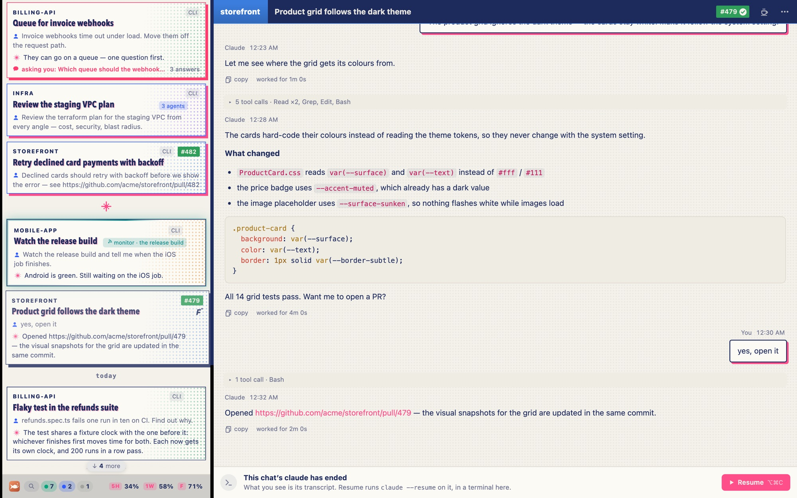

# Design studies — what is kept for later

On 2026-10-09 seven visual directions for the board (A–G) and five motions (M1–M5) were drawn from two apps of the same
kind (Paseo, Orca) and from the board's own world, each as a style laid over the real page on a made-up board. Ricardo
picked B (ink cards), C (lanes), E (the floating header, as a switch), F (the status bar), M2 (sonar), M3 (the landing
wash) and M5 (the edge light, as a switch) — all built (see `docs/DECISIONS.md`, 2026-10-09). One is kept here to be
pursued later.

## G · Riso — a light theme printed in two inks

> "G definetely a theme we should persue at a later stage (save the intention and screenshot/data to support future
> development)" — Ricardo, 2026-10-09



**The intention**: a light theme that looks printed, not lit — a risograph's two inks on off-white paper. Loud on
purpose; a theme to pick, not the default.

**The palette** (`riso.css`, the tokens on `:root`):

| token | value | what |
|---|---|---|
| `--bg` | `#f3f1ea` | the paper |
| `--panel` | `#fbfaf5` | a card, a panel: a whiter sheet |
| `--ink` | `#1d2a5c` | the first ink: navy, for every word and outline |
| `--accent` · `--needs` | `#ff4f8b` · `#ff3d6e` | the second ink: fluorescent pink |
| `--working` | `#2f5bff` | clauding, a blue the navy and pink both sit with |
| `--idle` | `#00a37a` | ready |

**The shapes**:

- Cards outlined in the ink (1.5 px, square), the project's colour a **halftone** of dots fading in from the right
  (a radial-gradient dot pattern under a paper-coloured gradient), never a wash.
- Titles condensed and heavy (Avenir Next Condensed, which macOS ships), with a pink **misregistration** — a 1 px offset
  text shadow, as two inks never quite line up.
- The open card and the busy ones stand on a **hard offset shadow** (no blur): ink for the open card, pink for a
  clauding one, pink-red for a question.
- The chat header's black and the splitter in the navy ink; your prompt's bubble an ink outline on paper with a pink
  offset; the transcript on a faint dot screen.

**What is left to decide when it is built**:

- It was drawn over the cards as they were that morning (a wash of the project's colour); since the same day the cards
  are ink cards (a lit edge and a glow). The halftone replaces the glow; the lit edge could become an ink rule.
- The ring, the edge light, sonar and the landing wash in two inks — the study only stilled the ring.
- A dark counterpart (ink on black paper?), or light only.
- Where the switch lives: a theme row in Settings → Board beside simple colours, which it would replace while on.

**To see it again**: open the board with the system in light mode (a browser, or Safari → Develop on the app) and, in
the console, put the file's text into a style:

```js
document.head.append(Object.assign(document.createElement('style'), { textContent: String.raw`…the text of riso.css…` }))
```
